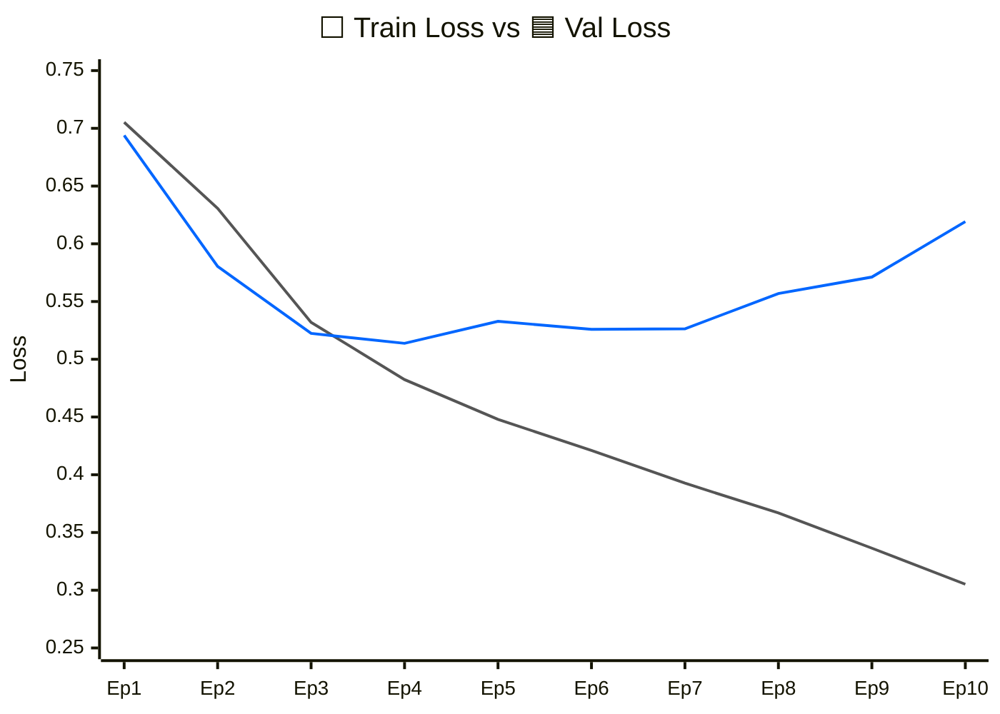
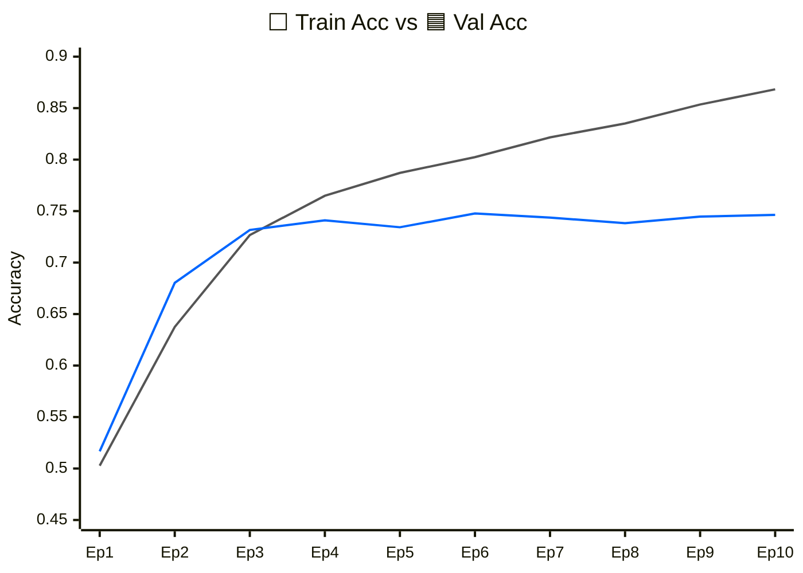

# mini GPT 구현 과제 보고서

## 0. 반·팀원

| 항목 | 내용 |
| --- | --- |
| 반 | (예: AI 1반) |
| 팀명 | (예: 3팀) |
| 팀원 | (예: 홍길동, 김철수) |

---

## 1. 구현 현황

| 단계 | 구현 내용 | 구현 파일 | 담당자 |
| --- | --- | --- | --- |
| 1 | UTF-8 byte-level BPE tokenizer | `src/bpe.py` | all |
| 2 | GPTDataset, create_dataloader, InputEmbedding | `src/dataset.py`, `src/embeddings.py` | all |
| 3 | MultiHeadAttention, causal mask | `src/attention.py` | all |
| 4 | LayerNorm, GELU, FeedForward, TransformerBlock, GPTModel, generate_text_simple | `src/model.py` | all |
| 5 | loss 계산, checkpoint, generate, train_model | `src/train.py` | all |
| 6 | NSMC 감성 분류 Dataset과 classifier | `src/finetune.py` | all |

---

## 2. 테스트 통과 현황

| 실행 명령 | 결과 | 비고 |
| --- | --- | --- |
| `pytest tests/test_bpe.py -v` | 통과 |  |
| `pytest tests/test_dataset.py -v` | 통과 |  |
| `pytest tests/test_attention.py -v` | 통과 |  |
| `pytest tests/test_model.py -v` | 통과 |  |
| `pytest tests/test_train.py -v` | 통과 |  |
| `pytest tests/test_finetune.py -v` | 통과 |  |
| `pytest tests/ -v` | 통과 |  |

실패한 테스트가 있다면 에러 요약을 적습니다.

| 실패한 테스트 | 에러 요약 | 해결 시도 |
| --- | --- | --- |
| (예: `test_train.py::TestGenerate::test_generate_shape`) |  |  |

---

## 3. 데이터

| 항목 | 내용 |
| --- | --- |
| 원본 데이터 | NSMC |
| 원본 경로 | `data/ratings_train.txt`, `data/ratings_test.txt` |
| 사전 학습 데이터 | `data/nsmc_lm_train.txt`, `data/nsmc_lm_val.txt` |
| 미세 조정 데이터 | `data/nsmc_sentiment_train.jsonl`, `data/nsmc_sentiment_val.jsonl`, `data/nsmc_sentiment_test.jsonl` |
| 전처리 방식 | 빈 리뷰 제거, 공백 정리, train/validation 분리 |
| 사용한 데이터 크기 | Light |

---

## 4. BPE

| 항목 | 내용 |
| --- | --- |
| 구현 파일 | `src/bpe.py` |
| BPE 방식 | UTF-8 byte-level BPE |
| 특수 토큰 ID | `<pad>=0`, `<unk>=1`, `<bos>=2`, `<eos>=3` |
| byte token ID 범위 | 4~259 |
| vocab_size | (예: 3000) |
| 학습 corpus 크기 | `corpus[:400000]` |
| 어휘 학습 시간 | CPU 기준 약 10분 |
| vocabulary 저장 경로 | (예: `data/nsmc_bpe_vocab_3000.json`) |
| 인코딩/디코딩 복원 예시 | (예: `decode(encode("이 영화는 좋았다")) == 원문`) |

---

## 5. 모델 구조

| 항목 | 내용 |
| --- | --- |
| 구현 파일 | `src/model.py` |
| 전체 구조 | InputEmbedding -> N x TransformerBlock -> LayerNorm -> LM head |
| vocab_size | 2000 |
| context_length | 64 |
| emb_dim | 128 |
| n_heads | 4 |
| n_layers | 2 |
| drop_rate | 0.1 |
| qkv_bias | False |
| 총 파라미터 수 | token_emb(2000×128) + pos_emb(64×128) + transformer_block(197,760×2) + final_norm(128×2) + lm_head(128×2000) + classifier(128×2+2) = 총 916,226개 |

---

## 6. 사전 학습

| 구분 | 항목 | 값 |
| --- | --- | --- |
| 모델 | vocab_size | 2000 |
| 모델 | context_length | 64 |
| 모델 | emb_dim | 128 |
| 모델 | n_heads | 4 |
| 모델 | n_layers | 3 |
| 학습 | batch_size | 256 |
| 학습 | num_epochs | 7 |
| 학습 | eval_freq, eval_iter | 기본값 |
| 최적화 | lr, weight_decay | 기본값 |

## 7. 미세 조정

| 항목 | 내용 |
| --- | --- |
| 구현 파일 | `src/finetune.py` |
| 과제 | NSMC 리뷰 긍정/부정 분류 |
| 데이터 포맷 | JSONL, `text`, `label` |
| max_length | 64 |
| batch_size | 	256 |
| backbone learning rate | 3e-4 |
| classifier learning rate | 3e-4 |
| validation loss / accuracy | 0.436 / 0.793 |
| test loss / accuracy | 0.453 / 0.788 |
| 오류 예시 | 과접합 문제 |

---

## 8. 실험 환경

| 항목 | 내용 |
| --- | --- |
| Python | Python 3.11 |
| PyTorch | PyTorch 2.12 |
| 실행 환경 | Colab GPU와 로컬 두 가지 병행|
| GPU/CPU 정보 | CPU: Ryzen 3500x, GPU: GTX 1650 |
| 총 학습 소요 시간 | 약 50분 |

---

## 9. 고찰

**초기 과적합 문제**  
그래프 결과(loss 기준):  

   

그래프 결과(accuracy 기준):  

 

**과적합 상태**가 발생하고 있음을 확인 가능하다  
과접합: 패턴을 못 배움
과소접합: 학습 데이터와 동기화 수준

관찰: 현재 train과 val의 그래프 방향이 다름: train의 지엽적인 특성을 패턴으로 인식함을 추정 가능하다. train 데이터의 패턴 파악조차 못하는 경우 과소 접합으로 판단되므로.  

- 어려웠던 점
- 한국어 byte-level BPE 구현에서 조심한 점
- loss가 줄어든 이유 또는 줄어들지 않은 이유
- 하이퍼파라미터 변경 시도와 결과
- 다음에 개선하고 싶은 점
