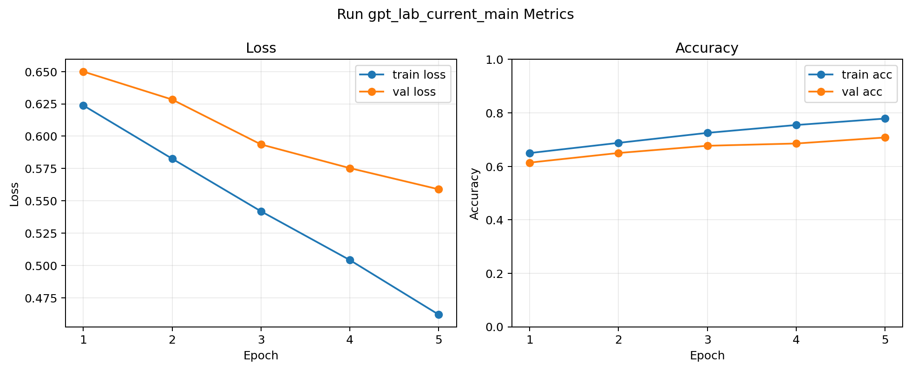

# Run gpt_lab_current_main

- started_at: 2026-06-03T11:55:04Z
- finished_at: 2026-06-03T12:26:21Z
- parent_run_id: None
- fit_status: good_fit
- overfit_score: 0.1677
- best_val_loss: 0.5589
- best_val_acc: 0.7080
- generalization_gap: 0.0970
- acc_gap: 0.0708

## Config

```json
{
  "train_path": "data/ratings_train.txt",
  "val_path": null,
  "val_ratio": 0.08,
  "seed": 42,
  "corpus_size": 500000,
  "train_data_size": 20000,
  "val_data_size": 2000,
  "vocab_size": 2000,
  "context_length": 64,
  "max_length": 64,
  "emb_dim": 128,
  "n_heads": 4,
  "n_layers": 3,
  "drop_rate": 0.1,
  "qkv_bias": false,
  "activation_name": "gelu",
  "batch_size": 256,
  "num_workers": 4,
  "epoch_num": 5,
  "learning_rate": 0.0003,
  "weight_decay": 0,
  "parent_run_id": null,
  "parent_checkpoint_path": null,
  "parent_tokenizer_path": null,
  "branch_on_epoch_overfit": false,
  "branch_probe_epochs": 1,
  "branch_max_events": 3,
  "overfit_generalization_gap_threshold": 0.15,
  "overfit_acc_gap_threshold": 0.08,
  "run_id": "gpt_lab_current_main"
}
```

## Runtime

```json
{
  "python_version": "3.10.20 | packaged by Anaconda, Inc. | (main, Mar 11 2026, 17:42:35) [MSC v.1942 64 bit (AMD64)]",
  "torch_version": "2.12.0+cu126",
  "platform": "Windows-10-10.0.19045-SP0",
  "device": "cuda",
  "cuda_available": true,
  "mps_available": false,
  "batch_size": 256,
  "max_length": 64,
  "context_length": 64,
  "emb_dim": 128,
  "n_heads": 4,
  "n_layers": 3,
  "drop_rate": 0.1,
  "model_device": "cuda:0",
  "train_rows": 20000,
  "val_rows": 2000,
  "model_params": 1113986
}
```

## Checkpoint Load

```json
{
  "mode": "fresh",
  "loaded_model_keys": 0,
  "loaded_optimizer": false
}
```

## Metrics

| epoch | train_loss | val_loss | train_acc | val_acc |
|---:|---:|---:|---:|---:|
| 1 | 0.6238 | 0.6500 | 0.6497 | 0.6140 |
| 2 | 0.5826 | 0.6283 | 0.6878 | 0.6500 |
| 3 | 0.5419 | 0.5936 | 0.7252 | 0.6770 |
| 4 | 0.5041 | 0.5753 | 0.7547 | 0.6855 |
| 5 | 0.4619 | 0.5589 | 0.7788 | 0.7080 |

## Metric Graph




## Next Hypothesis

Keep this run as a candidate final model and avoid using test data until final selection.
